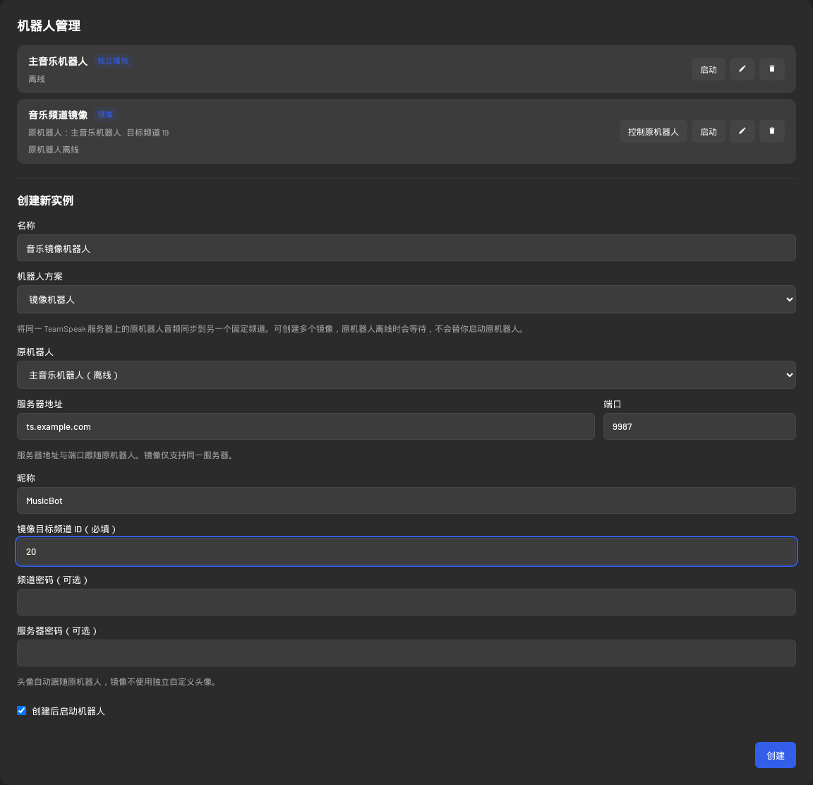
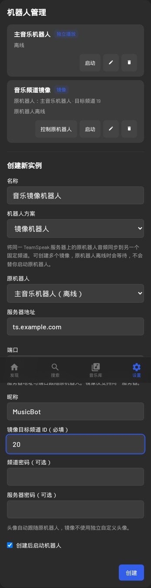

# TeamSpeak Music Mirror

可通过网页配置的 TeamSpeak 音乐机器人：创建独立播放机器人，再将音乐同步到一个或多个固定频道。包含 WebUI、音乐源、账号权限、播放队列和 Docker 自动构建。

本项目是完整音乐机器人 fork。原机器人与镜像由同一应用管理，直接转发同一播放器产生的 Opus 帧；无法监听或镜像由其他程序运行的机器人。镜像使用自己的 TeamSpeak 身份、名称与连接，音频、歌曲、队列、进度、音量和头像跟随原机器人。

## 功能与机器人方案

| 功能 | 独立播放 | 镜像机器人 |
| --- | --- | --- |
| 播放器、音乐源、队列 | 独立管理 | 跟随选定原机器人 |
| 播放、暂停、切歌、进度、音量、播放模式 | 可操作 | 只读；可跳转到原机器人操作 |
| TeamSpeak 身份、昵称、连接与频道 | 独立配置 | 独立身份与昵称，固定数字频道 ID |
| 歌曲封面、自定义空闲头像、清除头像 | 按原形象设置更新 | 复制原机器人实际成功设置的头像 |
| 听众与无人暂停 | 统计自身及全部镜像频道 | 听众参与原机器人的合并统计 |
| 网页与聊天点歌 | 可按权限操作 | 网页控件禁用，聊天命令忽略，写入 API 拒绝 |
| 原机器人离线 | 自身运行 | 等待原机器人，不擅自启动它 |

一个独立播放机器人可以有多个镜像。镜像必须在相同 TeamSpeak 服务器地址和语音端口，不能镜像自己、另一个镜像或不存在的机器人；不允许链式镜像和循环。不同独立播放机器人可以分别拥有自己的镜像。

## WebUI 配置



<details><summary>查看移动端布局</summary>



</details>

1. 打开 **设置 → 机器人管理**，先创建「独立播放」机器人，配置服务器、昵称与原频道，按需启动。
2. 再创建实例，将 **机器人方案** 设为「镜像机器人」。选择原机器人后，表单会自动填写其服务器地址与端口；列表只提供当前账号可访问的独立播放机器人，也会标注离线实例。
3. 填写镜像的名称、昵称和 **固定目标频道 ID**。该 ID 必须是正整数，镜像不使用频道名称定位。服务器或频道有密码时填写相应密码。
4. 镜像默认勾选「创建后启动机器人」：创建成功后尝试连接，并保存自动启动配置。如果连接失败，实例仍保留，网页提示重试启动，不需要再次创建。
5. 由 TeamSpeak 管理员设置目标频道和机器人权限，步骤见下方。网页不会替你修改服务器权限。

镜像关系保存到 `/app/data/tsmusicbot.db`，不用编辑 JSON。机器人启动时会恢复方案；旧数据库自动新增所需字段，已有独立播放机器人保留原行为。

### 编辑、状态与操作体验

- 编辑已有实例可切换独立播放/镜像、选择其他原机器人或修改目标频道。**先停止实例再改方案或连接信息**，保存后重新启动；名称可在运行时直接修改。连接握手中的实例也受后端保护。
- 机器人列表展示方案标识、原机器人和同步状态。「原机器人离线」表示等待来源；「镜像未连接」表示输出未连接；「同步播放中」表示两端连接且来源正在播放；「等待原机器人播放」表示来源目前未播放或暂停。
- 选中镜像后出现说明卡片，展示来源和状态。桌面和移动端的播放、队列、点歌及已存队列写入操作会禁用，并提供「控制原机器人」入口。此入口切换网页当前实例，也会更新专属链接；不会自动开始播放或替你启动来源。
- 无权访问原机器人的账号仍可查看获准访问的镜像，但看不到来源名称/ID，不能跳转或改镜像关系。选取来源时，后端同时校验目标与来源权限，不能通过伪造请求镜像未获授权的实例。
- 保存中禁用重复提交；读取配置失败时可重试，不能用未读取的空配置覆盖已有设置。输入错误、启动失败和运行中改连接都会给出提示。
- 镜像不提供独立头像上传和形象设置。需要改封面、自定义空闲头像或相关开关时，操作原机器人；解除镜像后可重新使用独立形象设置。
- 删除原机器人前必须先解除或删除其镜像。后端拒绝留下悬空关联；停止原机器人可以保留全部镜像，镜像等待来源恢复。

### 同步与恢复细节

原播放器使用同一个时钟将已编码 Opus 帧发送给各镜像，不额外下载音源或再次编码。目标传输或头像更新失败不会打断原机器人。原机器人重新创建或镜像重连时，应用会重新绑定同步关系。

头像仅复制原机器人**成功上传或清除后的结果**，包括歌曲封面、空闲时的自定义头像和头像清除。重连后重新应用最近成功设置的头像，写入序列化且过期回调被丢弃。关闭原机器人头像更新时，镜像跟随其实际头像状态，不会单独获取新的封面。

无人自动暂停和空闲断线合并原频道与全部镜像频道的听众，排除应用管理的 bot，并对同频道/重叠名单去重。不能查询听众时按未知处理，避免错误认为无人。听众返回只恢复此前**自动暂停**的播放，手动暂停保持不动；镜像自己的空闲计时不会自行断开输出。

镜像在错误频道时不发送音频，并尝试回到固定频道。这是应用的保护措施；阻止其他成员移动它、静音频道成员仍需服务器权限。跨网络或服务器负载造成的延迟仍可能存在，同一帧输出不保证两个客户端扬声器在物理上完全零延迟。

## TeamSpeak 固定频道与静音权限

创建永久音乐频道，推荐使用 **Opus Music** 编码。确保两台 bot 都能加入相应频道，并配置：

| 对象 | 权限/配置 | 用途 |
| --- | --- | --- |
| 原 bot 与每个镜像 | `b_virtualserver_client_list=1` | 查询听众，支持合并人数与自动暂停 |
| 目标频道 | `i_channel_needed_talk_power` 高于其他成员有效 talk power | 其他成员留在频道收听，不能讲话 |
| 镜像身份 | `i_client_talk_power` 足够满足目标频道 | 仅镜像输出音乐 |
| 镜像身份 | `i_client_needed_move_power` 高于其他成员有效 move power | 阻止成员移动镜像 |
| 目标频道 | `b_client_set_flag_talker=0`，并检查现有 talker 标记 | 避免其他成员绕过讲话要求 |

例如其他成员有效权限为 75 时，可以使用频道 talk power 76、镜像 talk power 76、镜像 needed move power 76。具体值取决于服务器实际组、客户端权限、频道组、Skip 与豁免。必要时给 bot 直接客户端权限设置 Skip；不要为了查询人数授予管理员组。

具有权限修改能力的管理员仍能更改这些设置。部署后应实际测试普通成员讲话、移动镜像、只有镜像频道有人时继续播放和所有频道无人时自动暂停。

## 保留的音乐与 WebUI 功能

| 功能 | 使用说明 |
| --- | --- |
| 网易云、QQ 音乐、酷狗 | 搜索歌曲/专辑/歌单/歌手，扫码绑定平台账号，按账号能力获取推荐和音源 |
| 哔哩哔哩 | 搜索视频、音频提取、热门推荐、链接播放和分 P 选择 |
| YouTube | 搜索和链接/歌单播放；Docker 内置 yt-dlp、FFmpeg 与 Node JS runtime |
| Jellyfin | 可选自建音乐库；设置服务器、用户名密码或 API key/用户 ID，再启用音源 |
| Spotify | 实验性可选；需要 Premium、自建开发者应用和额外 sidecar/播放后端，不因安装本镜像就自动可用 |
| 播放控制 | 播放/暂停、上一首/下一首、进度、音量；顺序、循环、随机、随机循环 |
| 队列与链接 | 单曲、歌单、专辑、分享文案与支持的短链接；懒解析避免排队时音源链接过期 |
| 本地上传 | 网页上传音频或视频，只播放其中音轨；数据存在 `/app/data/local-audio`，按应用规则清理 |
| 保存清单 | 可选启用，保存自己的或共享清单，替换加载或追加；镜像请到原机器人操作 |
| 重启恢复 | 开启保存队列功能后尽力恢复队列；当前曲目从开头恢复，不保存精确播放位置 |
| 歌词与历史 | 实时歌词及翻译、播放历史、当前曲目的实际试听/完整时长显示 |
| 收藏与推荐 | 个人收藏、歌单、推荐、歌手页面；各平台能力和登录要求不同 |
| 私人 FM | 网易云、QQ、酷狗和 Jellyfin 等支持的电台；网页用户可绑定自己的网易云账号 |
| 形象更新 | 独立配置头像、歌曲昵称、描述、Away、频道描述；权限不足时降级 |
| 语音闪避 | 可选在其他成员讲话时降低音乐音量，参数在行为设置中配置 |
| 多实例 | 多个独立播放器可使用不同服务器和队列；每个镜像只跟随自己的来源 |
| 网页体验 | 深浅主题、移动端布局、搜索翻页、专属机器人链接 `/bot/<id>` |
| 账号与权限 | 首次创建管理员；成员角色、细粒度操作权限和机器人访问白名单 |
| 访客 | 默认关闭，可配置点歌能力与实例范围，不能修改管理设置 |
| API Key | 用户在账户设置创建；请求受相同能力和机器人范围限制，秘密不可提交源码 |

音源开关由 `enabledProviders` 控制，默认音源在设置中选择。音乐质量包括标准、较高、极高、无损等上游支持的等级，实际取决于音源平台、登录账号和订阅；应用不保证所有平台每首歌曲都可用。

### TeamSpeak 聊天命令

下列命令发给独立播放机器人。前缀默认 `!`，可以配置；镜像不处理聊天点歌。默认平台取决于配置，不固定为某一平台。

| 命令 | 作用 |
| --- | --- |
| `!play <关键词/链接>` | 搜索或解析链接并播放 |
| `!play -n/-q/-k/-b/-y/-j <关键词>` | 指定网易云/QQ/酷狗/B站/YouTube/Jellyfin |
| `!search <关键词> [平台标志]` | 列出搜索结果；随后 `!play #<序号>` 选择 |
| `!play id <id>`、`!add <关键词/链接>` | 精确播放或加入队列 |
| `!pause`、`!resume`、`!next`、`!prev` | 暂停/恢复/切歌 |
| `!stop`、`!vol <0-100>` | 停止并清空队列、设置音量 |
| `!queue`、`!remove <位置>` | 查看队列、删除指定位置（从 1 开始） |
| `!mode <seq/loop/random/rloop>` | 顺序/循环/随机/随机循环 |
| `!playlist <歌单名/ID/链接>`、`!album <名称/ID>` | 加载歌单、专辑 |
| `!artist <歌手名> [平台标志]` | 歌手循环播放 |
| `!fm`、`!fm -q/-k/-j` | 私人 FM/QQ 雷达/酷狗电台/Jellyfin Instant Mix |
| `!save <名称>`、`!load [-a] <名称>`、`!queues` | 保存、替换或追加加载、列出共享清单（需启用） |
| `!lyrics`、`!now`、`!vote` | 歌词、当前播放、投票跳过 |
| `!move <频道名>`、`!help` | 移动独立播放机器人、显示帮助 |

## Docker 快速开始

支持 `linux/amd64` 和 `linux/arm64`。完整镜像包含后端/WebUI、Node.js 22、系统 FFmpeg、Opus/SQLite 原生模块，以及固定版本 **yt-dlp 2026.08.19**（下载校验 SHA256）。不用再手工挂载补丁 dist 或宿主机 yt-dlp。

本地构建并启动：

```bash
docker compose up -d --build
```

访问 `http://localhost:3000`，创建管理员，然后按上面的 WebUI 步骤配置实例。数据和媒体默认分别来自 `./data`、`./media`。

使用 GitHub Actions 构建的镜像，将 `<owner>` 替换为实际所有者的小写名称：

```bash
export TSMUSICBOT_IMAGE=ghcr.io/<owner>/<repository>:main
export DATA_PATH=/path/to/music-mirror/data
export MEDIA_PATH=/path/to/media
docker compose pull
docker compose up -d --no-build
```

镜像使用 `/app/data` 持久化数据库、账号、TS 身份、平台 Cookie、头像、上传文件和日志。`/mnt/media` 为可选只读外部媒体挂载，不会自动导入整个目录；上传目录仍在 data 内并需要可写。

| 部署变量 | 默认/作用 |
| --- | --- |
| `TSMUSICBOT_IMAGE` | `teamspeak-music-mirror:local`；使用 GHCR 时替换 |
| `DATA_PATH`、`MEDIA_PATH` | `./data`、`./media` 宿主路径 |
| `WEB_BIND_ADDRESS`、`WEB_PORT` | `0.0.0.0`、`3000`；应用内 `webPort` 保持 3000 |
| `HTTP_PROXY`、`HTTPS_PROXY` | 可选出站代理；Compose 同时传入小写变量供 FFmpeg 使用 |
| `NO_PROXY` | `localhost,127.0.0.1,::1`；嵌入的音乐 API 必须绕过代理 |

可复制 `.env.example` 为部署端 `.env` 修改这些值。代理认证、机器人身份、平台 Cookie 和账号只能放在运行端受保护的数据/配置中，不提交公开仓库。

### YouTube 与可选平台

YouTube 默认在可启用音源中。先尝试搜索或播放公开视频链接。需要代理时同时配置 HTTP/HTTPS 代理并保留本地 `NO_PROXY`；TeamSpeak UDP 语音不走 HTTP 代理。yt-dlp 使用镜像内 Node runtime 处理 JS 挑战，缓存位于 data。部分视频仍可能要求平台登录或受地区/年龄等限制，yt-dlp 固定版本也可能因上游变化需要更新重建。

Jellyfin 在网页设置中输入库地址和认证方式，再开启音源；密码/API key 为写入配置，网页只报告是否已保存。Spotify 为上游实验性功能：需要额外播放后端、开发者 Client ID/回调地址与 Premium；请按上游 Spotify 配置步骤准备，镜像未内置其 sidecar。

## GitHub 自动构建与镜像发布

默认交付使用名称以 `-private` 结尾的私有仓库，例如 `teamspeak-music-mirror-private`。源码保持可公开发布，仓库和镜像可见性按部署授权决定；不会自动改动已有仓库的名称或可见性。

`.github/workflows/docker-publish.yml` 在 `main` 推送、`v*.*.*` 标签或手动触发时先进行类型检查、测试和配置验证，再构建两个架构并发布到该仓库对应的小写 GHCR 路径。PR 仅测试和构建，不推送镜像，也没有包写入权限。

以下配置保存在 GitHub Repository Variables；手动运行还可覆盖额外 tag、平台和基础镜像。

| CI 变量 | 默认/用途 |
| --- | --- |
| `IMAGE_REGISTRY` | `ghcr.io`，可换其他 OCI registry |
| `IMAGE_NAME` | 小写 GitHub `owner/repository`，可自定义镜像名 |
| `IMAGE_PLATFORMS` | `linux/amd64,linux/arm64`，可选择其中一种 |
| `NODE_IMAGE` | `node:22-bookworm-slim`；三个构建阶段共用，需 Debian/apt 与支持的 Node 版本 |
| `IMAGE_EXTRA_TAG` | 可选额外镜像标签；输入经过校验 |

非 GHCR registry 登录使用 CI secrets `REGISTRY_USERNAME` 和 `REGISTRY_PASSWORD`。本地 Compose 可通过 `NODE_IMAGE` 设置构建基础镜像，通过 `TSMUSICBOT_IMAGE` 设置完整镜像地址；镜像加速源可作为基础镜像地址或 registry 使用。秘密只存储于 CI secrets 或部署端凭据存储。私有 GHCR 拉取需要具备读取包权限的认证，不能假定仓库 Contents token 同时支持镜像拉取。

主分支生成 `main`、`latest` 和长 SHA 标签；版本标签如 `v1.0.0` 生成对应版本系列标签。工作流使用 GitHub 提供的 `GITHUB_TOKEN`，不用在仓库放个人令牌。私有部署保持 GHCR package 为 Private，拉取需另行具备 Packages 权限；不要为绕过拉取问题改为 Public。公开仓库本身不代表包已公开。正式部署固定版本或 digest。

私有仓库默认还会独立交付带完整 commit 标签和 SHA256 的 GitHub Release Docker archive，在 GHCR 拉取不可用时可加载到 NAS。仓库变量 `DOCKER_RELEASE_ARCHIVE=false` 可关闭，`DOCKER_ARCHIVE_PLATFORM` 默认 `linux/amd64`，支持改为 `linux/arm64`；公开仓库 fork 自动跳过此任务。详见 [私有 Release 交付](docs/DEPLOYMENT.md#私有-release-交付无需-ghcr-拉取权限)。 Release 正文同时记录 CI 检查和各构建任务的结论；失败时提供经过过滤的步骤、测试名称或 TypeScript 错误码，不存储原始日志、异常堆栈和秘密。只有 `archive_ready` 状态及哈希校验均通过的归档可用于部署。

## TrueNAS SCALE 25.04 自定义应用

先准备独立 data 路径，在 **Apps → 安装自定义应用** 使用 Compose YAML。替换以下占位符，安装后访问 WebUI：

```yaml
services:
  music-mirror:
    image: ghcr.io/<owner>/<repository>:<version>
    init: true
    restart: unless-stopped
    ports:
      - "3000:3000"
    volumes:
      - /mnt/<pool>/apps/music-mirror/data:/app/data
      - /mnt/<pool>/media:/mnt/media:ro
    # 需要出站代理时配置相同的大写/小写 HTTP、HTTPS、NO_PROXY 变量。
    stop_grace_period: 30s
```

数据目录需容器运行用户可写，外部媒体只需读权限。不需要媒体挂载时删除对应行。服务器和密码在网页/data 内配置。网络必须允许应用连接 TeamSpeak 语音端口及头像文件传输端口；HTTP 代理不能替代这些连接。

### 旧应用迁移和回退

先部署验证新应用，再切换身份与入口，最后停用旧服务；保留旧应用和数据用于回退。

1. 确认新镜像能拉取，记录旧版本、端口、代理、媒体和 data 路径。准备独立新 data 与临时 WebUI 端口，避免争用旧入口。
2. 旧应用继续服务。使用 SQLite 官方 backup API 获得一致性数据库副本，并复制其余持久数据；不能在运行中简单复制 `.db`，也不能把实时 WAL 混到已完成 backup 的副本中。新副本初始关闭全部自动连接，避免复用正在运行的 TeamSpeak 身份。
3. 在临时端口部署新应用，验证健康检查、管理员登录、WebUI 方案、持久化及功能。需要验证语音网络时使用独立测试身份，不能同时复用原身份。
4. 准备回退后执行切换：停止旧 bot 连接，再让新应用使用原身份与频道，接管原入口；核实两端音频、头像、队列和固定频道权限。切换期间会有短暂播放中断。
5. 旧 `mirror.json`/环境配置兼容但在网页显示部署锁定；迁移时可先把来源关系写入新副本的目标 `mirrorSourceBotId`，再撤除副本中的旧绑定，让后续通过 WebUI 管理。
6. 新应用、入口和实际功能都验证后，旧应用保持停止，保留原 data。若预部署失败，旧服务继续运行；切换后失败，先停止新应用，再恢复旧应用与入口。

切换前如旧应用仍会产生队列/账号等新数据，应在切换窗口刷新一致性副本或明确迁移时点，避免丢失新变化。不得让双方共享可写数据库或同时连接同一身份。新应用运行期间的新数据不会自动回流旧副本；数据库升级回退使用对应版本备份。

## 高级部署绑定（兼容旧配置）

推荐使用 WebUI；以下用于已有部署或希望由运维锁定关系的环境：

```json
{"sourceBotId":"REPLACE_WITH_SOURCE_BOT_ID","targetBotId":"REPLACE_WITH_TARGET_BOT_ID"}
```

保存为 `/app/data/mirror.json`，或成对设置 `MIRROR_SOURCE_BOT_ID`/`MIRROR_TARGET_BOT_ID`。环境 IDs 优先于文件，再叠加数据库管理的其他镜像；被此绑定指定的目标以部署关系为准，在网页中只读。`MIRROR_CONFIG_PATH` 可覆盖文件路径。

这两个环境变量必须同时非空、不同；显式配置空路径或不存在文件、来源/目标缺失或不合法都会阻止启动。未设置高级配置时只使用网页保存的方案。默认 Compose 不传入空镜像 ID；只在 `.env` 里写镜像 ID 不会自动进入容器，需明确添加到 service environment。

## API 与权限

网页和 REST 使用相同的能力与实例范围校验。管理员可管理全部实例；成员需要 `bot.manage` 才能创建/编辑方案，并需能访问选定来源。播放器与保存队列写入需要对应播放/队列能力。WebSocket 同样按实例范围过滤，并隐藏不可访问的来源信息。

`POST /api/bot` 创建，`PUT /api/bot/:id` 修改；`mirrorSourceBotId` 为空字符串表示独立播放，非空为来源 ID。`GET /api/bot`、`GET /api/bot/:id` 和 WebSocket 状态包含 `mode`、来源、固定频道、同步状态和部署锁定信息；无来源权限时隐藏名称/ID并标记不可访问。

镜像播放器、队列加载/保存、头像与形象写入返回 **409**，请转到原机器人。关系或输入不合法返回 **400**，权限不足 **403**；运行中改方案/连接、部署锁定或仍被镜像依赖的删除返回 **409**。API Key 通过上游支持的认证头使用，与网页登录遵循同样范围，详见 API 文档。

## 开发、验证与更新

Node.js 使用 `^22.12.0` 或 `>=24`；Docker 固定 Node 22。本地需 FFmpeg 与原生构建工具。

```bash
npm ci
npm ci --prefix web
npm run build
FFMPEG_BIN=/usr/bin/ffmpeg npm test
```

测试涵盖配置迁移、多个镜像帧/头像同步、人数去重、断线、拒绝无效关联、停止后改方案、来源访问限制和只读保护。Dockerfile还检查原生模块、FFmpeg和yt-dlp；修改代码后构建完整镜像更新，不使用旧官方镜像叠加 dist。

更新前备份 data 并记录 digest，拉取固定的新版本后重建应用，检查日志和上述业务功能。TrueNAS 修改应用镜像版本后更新；Compose 使用 `docker compose pull` 和 `docker compose up -d --no-build`。

### 常见问题

| 现象 | 检查方式 |
| --- | --- |
| 没有可选原机器人 | 先建立独立播放实例；检查当前账号访问范围 |
| 保存提示先停止 | 停止正在连接/运行的目标，再修改方案或连接 |
| 来源离线但镜像在线 | 启动原机器人；镜像不会替你启动来源 |
| 有歌曲状态但无声音 | 检查原播放器、目标实际频道、talk power、静音和网络 |
| 只有镜像频道有人仍暂停 | 检查所有 bot 的 client-list 权限；未知名单不应视为无人 |
| 头像未更新 | 检查原机器人是否实际成功更新、文件传输权限与端口；镜像跟随成功结果 |
| 普通成员仍可讲话/移动 | 检查有效权限、频道组、Skip、talker 标记与管理员豁免 |
| UI 显示部署锁定 | 仍存在旧文件/环境绑定；按高级配置或迁移说明处理 |
| YouTube 无法解析/播放 | 检查网络代理、FFmpeg 小写代理、地区/登录限制及 yt-dlp 版本 |
| 回退后出现新数据缺失 | 新旧应用使用不同副本，需另行迁移新应用数据 |

## 上游与许可证

基于 [ZHANGTIANYAO1/teamspeak-music-bot](https://github.com/ZHANGTIANYAO1/teamspeak-music-bot) `v1.15.2`，commit `28c128d0c954c4bd6fb3a5f33f00b33282033462`，保留 MIT 许可证与 `Copyright (c) 2026 TSMusicBot Contributors`。新增功能、当前配置和部署方式以本 README 为准。

原始功能说明保留在 [docs/UPSTREAM.md](docs/UPSTREAM.md) 供历史/平台深度配置参考；[docs/API.md](docs/API.md)、[docs/MIRROR.md](docs/MIRROR.md)、[docs/DEPLOYMENT.md](docs/DEPLOYMENT.md) 是详细补充。运行数据、账号、身份与秘密不属于公开源码。
